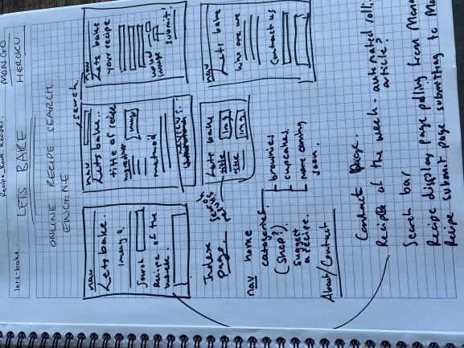
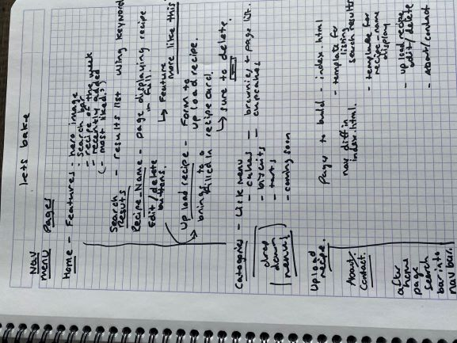

# LETS BAKE

A Baking website for anyone to find and add baking recipes.

## UX
This website is design for individuals looking for baking recipes and inspiration. 
Users will be able to search using keywords for recipes(feature not enabled yet). Use a dropdown menu to browse categories of recipes, 
as well as upload (images uploading but not being rendered back onto website), edit and delete their own recipes(features not enabled yet). 
This site will inspire users to get their mixing bowls.

## Design

The design process was based on an idea of modern hipster baking. Making baking cool and by using bold fonts and clear none fussy recipe cards. The site 
can show a more modern view on baking moving away from over complicated, fussy recipe websites that are already out there. By being open to all, kinda like wikipedia,
the recipes are added by users for others to try. 
The wireframes below show the initial thought process to getting started with LetsBake.  

## Features
Index page - This page is the landing page with a bold image and introduction to the site. All recipes are displayed for the user to casually scroll through. 
The nav bar at the top has a dropdown menu of categories, and the search bar which will search for recipes by keyword(feature not enabled).

Categories page - These pages allow users to narrow their search for a recipe by displaying the recipes by category such as Cakes or Biscuits. With more "coming soon".

Add Recipe page - This page allows uses to enter their own recipe which will then be uploaded into our Recipes Book database, the user will be taken to a thank you message. 
And immediately the recipe will be displayed both on the index page and with in the relevant category page.

Edit Recipe page - A modified copy of the add recipe page which will pull the recipe information from Mongo into the table for editing and resubmitting.

### Existing Features
Each recipe is displayed on a recipe card. The image of the card will be rendered from the Mongo database by recipe_id. (feature not enabled).
The recipe card displays all the database information. Recipe name, category, preparation time, cooking time, how many it serves, effort level, ingredients, and method.
(The ingredients and method drop down buttons display the text none formatted, I haven't find a way to display the text in a formatted way)
Each card also has an edit and delete button. The edit button takes the user to the edit recipe page to allow modification to the recipe on that card.
And the delete button which will delete the recipe on that card from the database.
(Note: The search, edit and delete functions are currently not active)

### Features Left to Implement
The CRUD elements need to be working correctly. 
The search feature needs to be implemented.

Initially the recipe card would be a linked card, moving to a full recipe page which would be where the list of ingredients and the method would be displayed.
This would then allow a section at the bottom, displaying three smaller recipe cards displaying 'other recipes you may like', taken be searching similar keywords.

The index page would also display a 'recipe of the week' and a 'recently added recipe'. And the all recipes would be moved into the categories.

A user login system would be a great addition to stop recipes being altered or deleted my mistake.

A recipe rating system would also allow customers to get a feel on the recipe before trying it out themselves.

## Technologies Used
Python
Flask
MongoDb
PyMongo
Bootstrap
Html
CSS

Deployed in Heroku
Repository in GitHub
Built in PyCharm

## Testing

##Debugging
Debugging, during first master push to heroku I kept receiving an error that the app was crashing. Through thorough checking and trying different fixes 
it was eventually solve through using gunicorn in the profile and update the requirements.txt. This resolved the issue through trying different fixes I 
also found an article to Config Vars for Deploy-Specific Settings for Heroku [Read that Article here](https://blog.heroku.com/config-vars). This enabled 
me to secure the secret key without having it displayed anywhere in my code. Pretty cool.

After some issues connecting to MongoDB, I tried installing mongo engine, after some research I thought using a more advanced ODM would allow for more advanced operators to be used and to bring more structure 
to the project. However, on installing I found it had a bug that then wouldn't allow my python file to run, so I uninstalled it. And have continued to use pymongo 
instead. 

After finding a cool plug in for the ingredients user input, I installed node.js in order to use angular in the project. However, the set up required upgrading 
to a professional pycharm package and also it would seem I would need to start the project over. Although, the feature would have enhanced UX and been an nice 
addition to use another language the complexity and time to do this has caused me to abandon this idea for now. The feature was 
[a user input, showing the items added in a bubble list](https://codepen.io/gfrancesca/pen/gbpoxQ)

After lots of difficulty connecting to mongoDB. One issues was the versions of database now matching the version of pymongo. I found success from following tutorial from 
[Tech with Tim](https://www.youtube.com/watch?v=rE_bJl2GAY8). This "fix" actually caused more issues and with a lengthy session with a tutor we solve the issues, one issue 
was a capital R. After getting connected was then able to but the Mongo set up details in a secure env.py file to ensure the password is secure and to stop the database from
being tampered with.

Some issues with rendering the information back from MongoDB. The initial set up of the recipe card rendered the different recipe cards well. However, I found some difficulty
adding a link to the card to then display the whole recipe including ingredients and method. After added an upload image function, this too would bring back the image when requested
by name, yet it wouldn't render in the recipe card. Also the new recipes uploaded by a user are displayed in the all recipe page but do not render when call via the category pages.

Due to a fatal error I have had to rebuild the project. The previous git repository is [here] (https://github.com/ClaireRoberts1403/lets-bake). The project was successfully rebuilt
although in my hast my heroku deployment is called 'calm-inlet' which is slightly ironic after my project imploded. Again in hast to continue project a bug must have been carried over. 
Starting more methodically the project will be rebuilt. Second repository is [here] (https://github.com/ClaireRoberts1403/Milestone3).  

In the final build I haven't been able to connect to heroku. The terminal states no app found yet git is pushing through the data. The previous fixes of the procfile and config vars
haven't fixed this issues and fixing the bug of "ValueError: you must specify a URI". Still caused the app to crash. With an error code h10. Due to the sheer amount of time I have already
spent trying to fix these issues and on this project as a whole. The final product I submit is no where near what I know is needed or what I wanted to hand in yet after a weeks extension, 
and hitting wall after wall I feel like I have to just accept defeat and move on. 

## Deployment
Using Pycharm as a integrated development environment, had both some positive features and some negative. The set up to Heroku was challenging 
but once connected (see debugging) it worked perfectly with PyCharm pushing to Git and up to Heroku automatically.
I particularly like how PyCharm makes it a lot easier to keep committing and pushing to git, having the ease of the rollback feature also allowed
some quick resetting when something went wrong.

To set up in PyCharm was relatively straight forward. 
- PyCharm sets up the environmental file on set up using the python language.
- I used pip install to install the relative packages (see requirements file). 
- I created the requirements file and the Procfile (see debugging)
- I linked up the project to a new git repository via the PyCharm interface.
- In Heroku I created a new project and database name. I then linked them via Git to my PyCharm project. In Heroku I set up the secret Key in the 
settings/config vars (Config Vars for Deploy-Specific Settings for Heroku [Read that Article here](https://blog.heroku.com/config-vars). This enabled 
me to secure the secret key without having it displayed anywhere in my code.).
-I also ensured I had inputted which language I was using Python. Using git to add and commit the set up and the Procfile, I then
deployed into Heroku using Git push Heroku master. Heroku now updates automatically each time I push to Git.

- To connect to MongoDB the database used for this project also came with issues (see debugging). However, the final set up is working fully.
- Using the env.py file created by PyCharm, in that file I added an import for os. Then added the following code:

os.environ["Mongo_URI"] = "This is taken via MongoDB from using the connect feature in using database collection you want to connect to".
os.environ["SECRET_KEY"] = "Can be anything you want".
os.environ["MONGO_DBNAME"] = 'Your database name'.

- Then in main.py the following set up was required to both connect to MongoDB using PyMongo and to use the Flask framework.

import os
from env import env
import time
from flask import Flask, render_template, request
from flask_pymongo import PyMongo, pymongo
from bson.objectid import ObjectId

env = env

app = Flask(__name__)
app.config["MONGO_DBNAME"] = os.environ.get("MONGO_DBNAME")
app.config["MONGO_URI"] = os.environ.get("MONGO_URI")
app.config['SECRET_KEY'] = os.environ.get("SECRET_KEY")

mongo = PyMongo(app)

## Credits
### Content
The text for section Y was copied from the Wikipedia article Z
### Media
The photos used in this site were obtained from ...
### Acknowledgements
I received inspiration for this project 